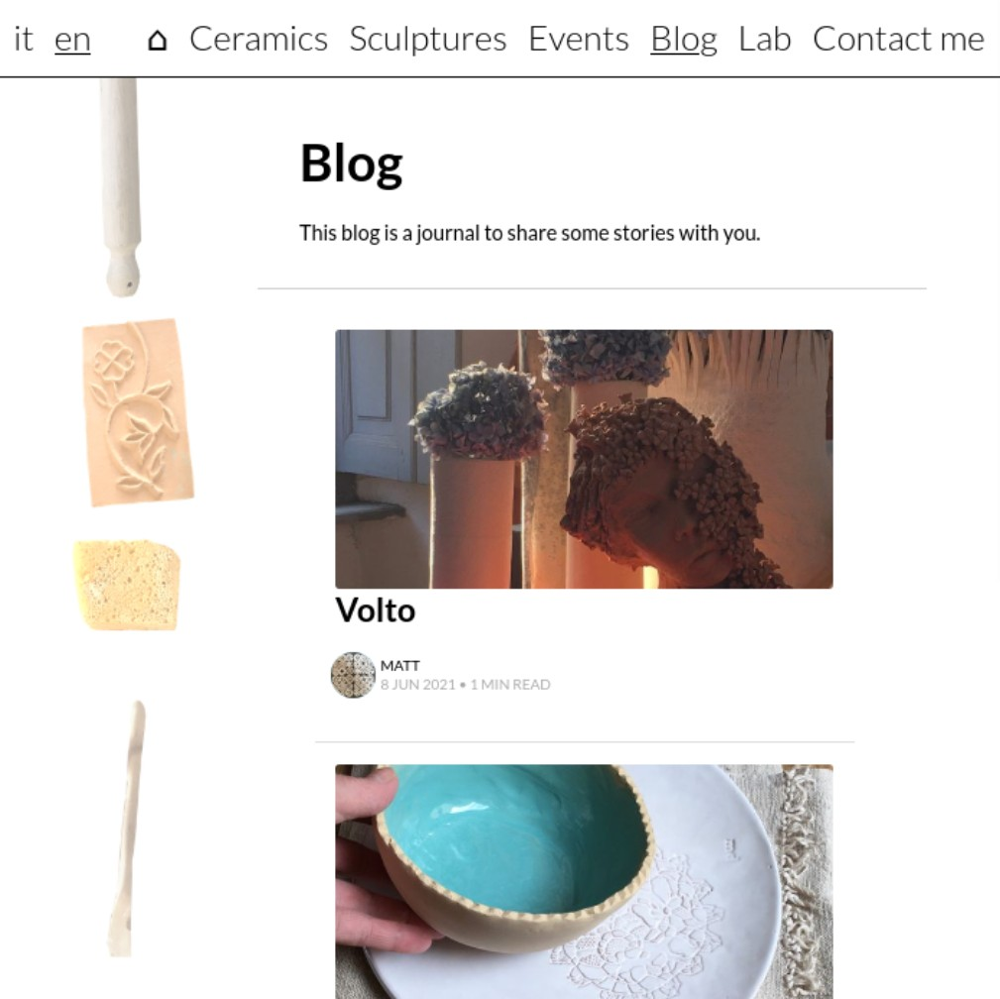

# magrav


Magrav is a theme for [the grav CMS](https://getgrav.org/). It allows you to create easily a website and blog that you can simply edit from markdown files or with the grav administrative interface.

This theme goal is to provide a simple multilingual website. It makes it easy to create a website with a few pages, a blog posts section, some events cards in a blogging style, a basic wiki...




## Using the theme

### Install

To use this theme, you will need to install grav, for instructions on how to do so see [here](https://learn.getgrav.org/basics/installation/), or even simpler use [yunohost](https://yunohost.org/) and the [yunohost grav package](https://github.com/YunoHost-Apps/grav_ynh).

Then just download the theme as a zip from [it's repository](https://framagit.org/squeak/magrav/), decompress it, add it to your site themes folder, run the `bin/buildDists.sh` script, and make magrav your active theme in your config/themes/magrav.yaml (or from the grav admin interface).

To make the best of magrav, it may be of some help to read the following sections, to understand how to use the theme. Even though if you use your site from the admin interface, most options are available and roughly explained there.


### General customization

#### Global options
The following table lists the available global options magrav proposes:

| variable name      | type   | default value | possible values         | explanation                                  |
| ------------------ | ------ | ------------- | ----------------------- | -------------------------------------------- |
| navbar-position    | string | "bottom"      | "bottom", "top"         | whether to display menu bar on top or bottom |
| navbar-separator   | string | "/"           | any string              | the character to use as separator between menu items |
| sides              | string | "both"        | "both", "left", "right" | whether to display the side bars on both side, only left, or only right |
| header-title_class | string | ""            | any string              | additional classes to add to the header's title |

#### Customize site colors, content width...
To customize the colors to use in the site, you can use the "Custom CSS" plugin.
For example, to make the content wider, you could use it to add the following:
```css
:root {
  --content_width: 60vw;
  --content_margin_horizontal: 100px;
}
```

The list of variables used by the theme, that you can customize is available in [the theme file](styles/general/theme.less).


### Special pages and media

#### Sides images and other images
To create a frieze of images on the sides of pages and posts, create a `/images/sides/` page, and add images to it. Images for the backgrounds will be chosen randomly from the images in this page.

Also, to set a favicon to your site, you may add it in the `/images/` page as `favicon.png`.

#### Authors
Posts will have an author, whether you set it in the post taxonomy.authors header, or defaulting to the site author.
You may create page for authors under `/authors/{{authorName}}/` using the `author` template.

To set the author's thumbnail, put it under `/authors/{{authorName}}/thumbnail.png`, `/authors/{{authorName}}/thumbnail.jpg` or `/authors/{{authorName}}/thumbnail.svg`.

#### Tags
Magrav also supports displaying a page grouping posts by tags.
For it to work, you should create a `/tags/` page using the `tag` template.


### Available page templates

Magrav let's you display nicely collections of blog posts, events and wiki articles.

The `blog` template displays a page listing children blog posts, with previews or excerpt, authors and dates...

The `calendar` template displays children blog posts with a bit more focus on their content, so that user does not necessarily have to open the event to read the content, also it doesn't specify the authors of the posts.

The `wiki` template displays the posts in a very dense way, only showing their title.

The `home` template will display your homepage.
Upload a background image and a title image. And use `img_background` and `img_title` headers to specify which is which. Also any content of the markdown file will be displayed as subtitle.

The `author` template as specified previously allows to display a page presenting an author. It supports the `website` header to specify the author's website url. Add `thumbnail.png` and `profile_image.jpg` media for more graphical author's presentation.

The `tag` template as specified previously allow to display a page grouping posts by tag.

The `gallery`, `gallery_raw` templates and `gallery` modular all allow you to display some gallery pages or sections. The `gallery_raw` template is the only one not displaying side bars.

The `modular` template let's you put up a page with modular pieces. Your subpages should start with an underscore.

The `post` template is used for blogposts. The first image of a post will be used as default image. Any other images you add will be displayed as a gallery at the end of your post's text. If you want to disable this behaviour, for example to introduce your images by yourself in your post content, set the `hide_additional_images_gallery` header to `true`.

Last but not least, the `default` template displays very simply your page content with it's title as header. You may set the following headers: `hide_header`, `hide_title` and `header_no_border` to true if you want to hide the whole title header, only the title, or hide the grey line at the header's bottom. Those three options can also be used in all other templates.


## Developing / Tweaking magrav

Grav themes have a simple enough structure, that it's fairly easy to customize any theme.
This theme uses it's own logic, for better editability, fragmenting logics and avoiding duplicating code as much as possible.

Basically grav uses a simple templating language called [Twig](https://twig.symfony.com/doc/2.x/) for its themes.

⚠️ If you get magrav from it's repository, scripts and styles are not built in assets. To test/use magrav, you'll need to build them (see the "Scripts and styles" section below for instructions on how to do it).


### Theme structure

#### Templates
The most important files are in the templates folder, this is where all the theme's logic resides. It defines pages and elements templates.

#### Partials and modular
The `partials` directory contains code pieces reused in different page templates.
The `modular` directory contains templates for subpages of modular pages.

#### Scripts and styles
All `.js` files in the `scripts/lib`, `scripts/modular` and `scripts/partials` directories, and all `.less` files in the `styles/general`, `styles/modular` and `styles/partials` directories are aggregated to be imported in every page.
Also each page imports the `scripts/{{pageTemplateName}}.js` script and `styles/{{pageTemplateName}}.less` stylesheet.

You may modify any file, or add any new one, but if you do so, you'll need to run `bin/buildDists.sh` to reaggregate the styles and scripts.
Note that to run, the `buildDists` script (that you can edit in ./bin/buildDists.sh) depends on the `lessc` command. So you'll have to install it if you want to be able to modify styles.

The easiest thing to do to customize magrav is probably to customize it's colors and display. You can do so by just tweaking a few variables in the `styles/general/theme.less` file.

#### Assets
The assets folder contains
 - the built scripts, styles and locales imported in the pages,
 - the fonts used in the pages (imported by the theme)

#### Blueprints
If you modify some templates, it may be necessary to modify their corresponding blueprint, so that the admin interface stays coherent with your modifications. See [grav blueprints docs](https://learn.getgrav.org/forms/blueprints) for more details.


### CSS classes structure

Magrav uses a quite structured class toponomy.
General magrav classes are in the form: `magrav-...`
Pages templates classes are in the form: `mat-{{pageTemplateName}}` and `mat-{{pageTemplateName}}--...-...` for subelements.
Partials templates classes are in the form: `mtp-{{partialTemplateName}}` and `mtp-{{partialTemplateName}}--...-...` for subelements.
Templates classes are in the form: `mtm-{{modularTemplateName}}` and `mtm-{{modularTemplateName}}--...` for subelements.


## Copyright & License

This theme is licensed under GNU-AGPLv3 license.
It is a grav adaptation of the [maghost ghost theme](https://squeak.eauchat.org/maghost/) and some of it's code is inspired from [grav antimatter theme](https://github.com/getgrav/grav-theme-antimatter).
