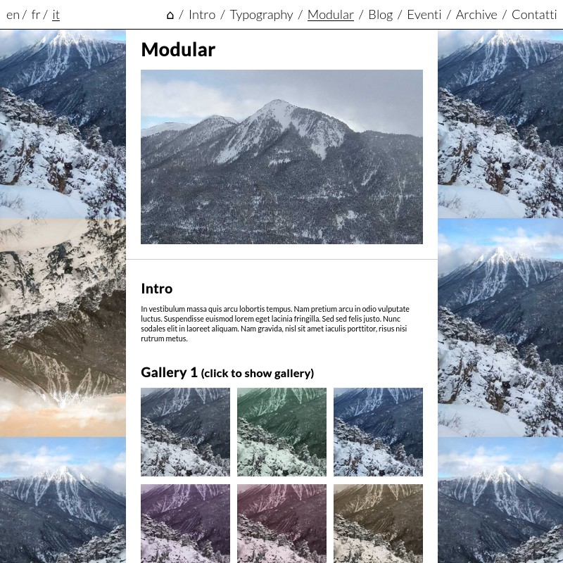

# grama


Grama is a theme for [the grav CMS](https://getgrav.org/). It allows you to create easily a website and blog that you can edit from markdown files or with the grav administrative interface.

This theme goal is to provide a simple multilingual website. It makes it easy to create a website with a few pages, a blog posts section, some events cards in a blogging style, a basic wiki...

This theme doesn't include by default reference to any social network, analytics scripts, or any GAFAM+ fonts or libraries. This a design choice to enhance site owners/visitors privacy. You may add any of those elements on your website by yourself, but please don't ask me to include them by default, since I designed this theme with the explicit goal not to have those elements baked in a theme.




## Using the theme

### Install

To use this theme, you will need to install grav, for instructions on how to do so see [here](https://learn.getgrav.org/basics/installation/), or even simpler use [yunohost](https://yunohost.org/) and the [yunohost grav package](https://github.com/YunoHost-Apps/grav_ynh).

Then just download the theme as a zip from [it's repository](https://framagit.org/squeak/grama/), decompress it, add it to your site themes folder, run the `bin/buildDists.sh` script, and make grama your active theme in your config/themes/grama.yaml (or from the grav admin interface).

To make the best of grama, it may be of some help to read the following sections, to understand how to use the theme. Even though if you use your site from the admin interface, most options are available and roughly explained there.


### General customization

#### Global options
The following table lists the available global options grama proposes:

| variable name         | type   | default value | possible values   | explanation                                                          |
| --------------------- | ------ | ------------- | ----------------- | -------------------------------------------------------------------- |
| navbar-position       | string | "bottom"      | "bottom", "top"   | whether to display menu bar on top or bottom                         |
| navbar-separator      | string | "/"           | any string        | the character to use as separator between menu items                 |
| sides                 | string | "both"        | "both", "left", "right", "none" | whether to display the side bars on both side, only left, or only right                                                                                                                                  |
| authors_page_slug     | string | "/authors/"   | any string        | parent path containing authors folders                               |
| tag_page_slug         | string | "/tag/"       | any string        | the path to your page with "tag" template                            |
| display_tags_in_post_cards | boolean | false   | true, false, null | whether to display a list of post tags in post cards                 |
| header-title_class    | string | ""            | any string        | additional classes to add to the header's title                      |
| hide_author_headlines | boolean | false        | true, false, null | whether to display author name and thumbnail in post cards and pages |
| hide_image_gallery_in_posts | boolean | false  | true, false, null | whether to display image galleries at end of posts                   |
| toggleable | object | {}  | any object | a list of elements that will be hidden by default unless the user clicks on a button (keys of the object are the toggled element jquery selectors, and values are jquery selectors for the elements that if clicked will trigger toggling)           |
| background-image      | string | ""            | any string        | path to background file to use in all or single page                 |
| background-size       | string | "cover"       | "cover", "contain"... | CSS background-size attribute to use                             |
| stylesheet            | string | ""            | any string        | CSS that will be added inline to every page                          |
| pageStylesheet        | string | ""            | any string        | use this in page headers to customize the given page stylesheet      |

#### Customize site colors, content width...
To customize the colors to use in the site, you can change values of grama theme CSS variables, you can do this through the stylesheet option or using the "Custom CSS" plugin.
For example, to make the content wider, you could add the following to stylesheet:
```css
:root {
  --content_width: 60vw;
  --content_margin_horizontal: 100px;
}
```

The list of variables used by the theme, that you can customize is available in [the theme file](styles/general/theme.less).

#### CSS classes and attributes you can use to customize elements in your pages
Grama provides a few simple classes and attributes you can use in your pages contents to style them.

| classes        | action |
| -------------- | ------ |
| centered       | will set text-align: center; css |
| centered_image | use it on image to center it |
| hidden         | hide the element |
| image_subtitle | make the element small, grey and centered (ideal for an image subtitle) |
| tag-button     | make the element look like a clickable button (with grey border around) |

##### grama-toggleable
Add this attribute to an element to make it hidden by default. The value of the attribute is a jquery selector. If clicked, all elements matching the jquery selector will trigger the toggling of the display of the element having grama-toggleable attribute.
Example:
```
<span class="span-to-click">Click here</span> to toggle image display.

```

### Special pages and media

#### Sides images and other images
To create a frieze of images on the sides of pages and posts, create a `/images/sides/` page, and add images to it. Images for the backgrounds will be chosen randomly from the images in this page.

Also, to set a favicon to your site, you may add it in the `/images/` page as `favicon.png`.

#### Authors
Posts will have an author, whether you set it in the post taxonomy.author header, or defaulting to the site author.
You may create page for authors under `/authors/{{authorName}}/` using the `author` template.

To set the author's thumbnail, put it under `/authors/{{authorName}}/thumbnail.png`, `/authors/{{authorName}}/thumbnail.jpg` or `/authors/{{authorName}}/thumbnail.svg`.

If you want to customize the `/authors/` path, use the `authors_page_slug` theme option.

#### Tags
Grama also supports displaying a page grouping posts by tags.
For it to work, you should create a `/tag/` page using the `tag` template. But if you wish, you can customize this default path in theme settings.


### Available page templates

Grama let's you display nicely collections of blog posts, events and wiki articles.

The `blog` template displays a page listing children blog posts, with previews or excerpt, authors and dates... If you want to have more focus on posts content, you can set the `post_cards_full_width` header option to true, this way posts won't be displayed in a grid but take up the whole page width, and a longer excerpt of the post will be displayed.

The `wiki` template displays the posts in a very dense way, only showing their title.

The `home` template will display your homepage.
Upload a background image and a title image. And use `img_background` and `img_title` headers to specify which is which. Also any content of the markdown file will be displayed as subtitle.

The `author` template as specified previously allows to display a page presenting an author. It supports the `website` header to specify the author's website url. Add `thumbnail.png` and `profile_image.jpg` media for more graphical author's presentation.

The `tag` template as specified previously allow to display a page grouping posts by tag. Don't forget to create a tag page. By default it's expected to have the `/tag/` slug, but you can customize it with the `tag_page_slug` theme setting if you wish.

The `tagslist` template lets you display a page listing all site tags.

The `gallery`, `gallery_raw` templates and `gallery` modular all allow you to display some gallery pages or sections. The `gallery_raw` template is the only one not displaying side bars.

The `modular` template let's you put up a page with modular pieces. Your subpages should start with an underscore.

The `post` template is used for blogposts. The first image of a post will be used as default image. Any other images you add will be displayed as a gallery at the end of your post's text. If you want to disable this behaviour, for example to introduce your images by yourself in your post content, set the `hide_image_gallery_in_posts` header to `true`. The `hide_header_image` option allows you to prevent from displaying an image in the post header and post card. And the `hide_author_headlines` option allows to prevent from displaying the author name and thumbnail (this option can also be used in blog, author and tag templates).

Last but not least, the `default` template displays very simply your page content with it's title as header. You may set the following headers: `hide_header`, `hide_title` and `header_no_border` to true if you want to hide the whole title header, only the title, or hide the grey line at the header's bottom. Those three options can also be used in all other templates.


## Developing / Tweaking grama

Grav themes have a simple enough structure, that it's fairly easy to customize any theme.
This theme uses it's own logic, for better editability, fragmenting logics and avoiding duplicating code as much as possible.

Basically grav uses a simple templating language called [Twig](https://twig.symfony.com/doc/2.x/) for its themes.

⚠️ If you get grama from it's repository, scripts and styles are not built in assets. To test/use grama, you'll need to build them (see the "Scripts and styles" section below for instructions on how to do it).


### Theme structure

#### Templates
The most important files are in the templates folder, this is where all the theme's logic resides. It defines pages and elements templates.

#### Partials and modular
The `partials` directory contains code pieces reused in different page templates.
The `modular` directory contains templates for subpages of modular pages.

#### Scripts and styles
All `.js` files in the `scripts/lib`, `scripts/modular` and `scripts/partials` directories, and all `.less` files in the `styles/general`, `styles/modular` and `styles/partials` directories are aggregated to be imported in every page.
Also each page imports the `scripts/{{pageTemplateName}}.js` script and `styles/{{pageTemplateName}}.less` stylesheet.

You may modify any file, or add any new one, but if you do so, you'll need to run `bin/buildDists.sh` to reaggregate the styles and scripts.
Note that to run, the `buildDists` script (that you can edit in ./bin/buildDists.sh) depends on the `lessc` command. So you'll have to install it if you want to be able to modify styles.

The easiest thing to do to customize grama is probably to customize it's colors and display. You can do so by just tweaking a few variables in the `styles/general/theme.less` file.

#### Assets
The assets folder contains
 - the built scripts, styles and locales imported in the pages,
 - the fonts used in the pages (imported by the theme)

#### Blueprints
If you modify some templates, it may be necessary to modify their corresponding blueprint, so that the admin interface stays coherent with your modifications. See [grav blueprints docs](https://learn.getgrav.org/forms/blueprints) for more details.


### CSS classes structure

Grama uses a quite structured class toponomy. Here is how it goes:

| CSS class                     | CSS sub classes                        | What it's used for             |
| ----------------------------- | -------------------------------------- | ------------------------------ |
| `grama-...`                   |                                        | General theme specific classes |
| `mat-{{pageTemplateName}}`    | `mat-{{pageTemplateName}}--...-...`    | Page templates                 |
| `mtp-{{partialTemplateName}}` | `mtp-{{partialTemplateName}}--...-...` | Partials templates             |
| `mtm-{{modularTemplateName}}` | `mtm-{{modularTemplateName}}--...`     | Modular templates              |


## Credits

This theme is a grav adaptation of the [maghost ghost theme](https://squeak.eauchat.org/maghost/) and some of it's code is inspired from [grav antimatter theme](https://github.com/getgrav/grav-theme-antimatter).
Grama is of any use only thanks to [the grav CMS](https://getgrav.org) which makes 99% of the work of making your website run, in fact.
And some stuff are made much easier by the following amazing javascript libraries: [jquery](https://jquery.com/) and [underscorejs](https://underscorejs.org/).
The theme logo is based on the grav logo.


## License

This theme is licensed under GNU-AGPLv3 license.
You're free to use, share, modify, republish codes and contents here only in fully free software and projects, and on infrastructures that provide services using exclusively free software compatible with the AGPL license. This work is free software, and wants to remain it, so you're not welcome to use it if you want to turn it into non-free software.
You're also very welcome to contribute to this work, and I'll do my best to integrate proposed contributions so that everyone using this theme can benefit improvements.

See [LICENSE](LICENSE) for the actual license text.
